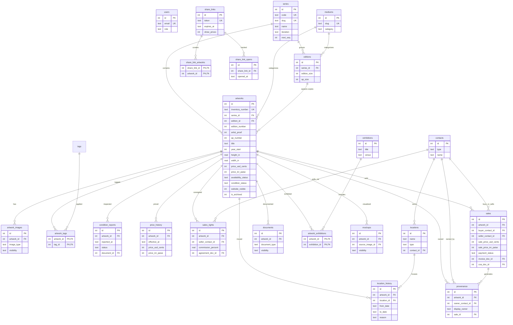

# RKK Inventory — ER diagram

19 tables, 3NF. Companion to `schema.sql`.

## Reading the diagram

- Series is the root organizing axis. Every artwork belongs to exactly one series.
- Editions sit between series and artworks. Uniques skip editions (`edition_id` NULL on artwork).
- One row in `artworks` = one physical object. Edition of 10 → 10 rows.
- Tags are orthogonal to series — for cross-cutting themes (mythology, pluralism, AI, etc.).
- Location, condition, and price are all tracked as history tables. "Current" is computed (latest row, or scalar columns on `artworks` cached).
- Contacts is the single source of truth for people/orgs — galleries, dealers, collectors, agents, institutions.
- Share links are the dealer-facing surface. Per-work or per-selection. Signed token, optional password, opt-in price visibility, optional expiry.
- Documents are blob references with type taxonomy. File bytes live in the data repo alongside the SQLite file.
